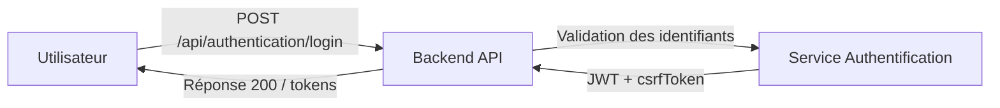
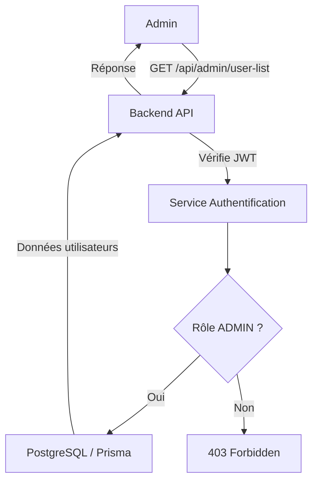
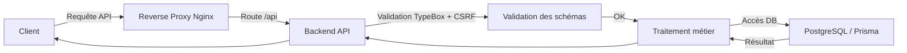

# Sécurité

Cette section présente les modèles de menace et les diagrammes utilisés pour analyser la sécurité de l'application.

## STRIDE

STRIDE est un modèle de menace permettant de structurer les risques en six catégories.

| Lettre | Menace                 | Description                                                   | Propriété violée |
| ------ | ---------------------- | ------------------------------------------------------------- | ---------------- |
| S      | Spoofing               | Usurpation d'identité ou de compte utilisateur.               | Authentification |
| T      | Tampering              | Modification non autorisée de données en transit ou au repos. | Intégrité        |
| R      | Repudiation            | Rejet d'une action effectuée sans preuve d'audit.             | Non-répudiation  |
| I      | Information Disclosure | Fuite d'informations sensibles vers un acteur non autorisé.   | Confidentialité  |
| D      | Denial of Service      | Interruption du service par surcharge ou blocage.             | Disponibilité    |
| E      | Elevation of Privilege | Obtention de droits supérieurs à ceux autorisés.              | Autorisation     |

### Application à Cesizen

- **Spoofing**
  - protection par JWT pour les requêtes authentifiées.
  - route de connexion `/api/authentication/login`.
- **Tampering**
  - validation des schémas TypeBox sur toutes les routes.
  - vérification `password === confirmPassword` sur les routes d'inscription et de réinitialisation.
- **Repudiation**
  - les actions sensibles nécessitent une authentification et des tokens CSRF.
- **Information Disclosure**
  - le backend ne renvoie pas de mot de passe brut.
  - le middleware admin restreint l'accès aux données sensibles.
- **Denial of Service**
  - `rateLimit` via `@fastify/rate-limit` sur l'authentification.
- **Elevation of Privilege**
  - `fastify.requireRole([Role.ADMIN])` sur les routes admin.

## DREAD

DREAD est un modèle de priorisation des menaces basé sur 5 critères :

- **Damage potential** : impact potentiel.
- **Reproducibility** : facilité de reproduction.
- **Exploitability** : difficulté à exploiter.
- **Affected users** : nombre d'utilisateurs affectés.
- **Discoverability** : facilité de découverte.

### Évaluation des risques API

| R                                        | M                                          | D   | R   | E   | A   | D   | Total |
| ---------------------------------------- | ------------------------------------------ | --- | --- | --- | --- | --- | ----- |
| `POST /api/authentication/login`         | Usurpation de session / brute-force        | 6   | 8   | 5   | 8   | 7   | 7     |
| `POST /api/authentication/register`      | compte non autorisé / injection de données | 5   | 5   | 5   | 5   | 7   | 5     |
| `PUT /api/authentication/reset-password` | prise de contrôle de compte par token volé | 8   | 6   | 5   | 8   | 5   | 6     |
| `GET /api/user/current`                  | accès utilisateur à des données privées    | 5   | 8   | 3   | 8   | 7   | 6     |
| `PUT /api/user/update-password`          | modification non autorisée de mot de passe | 7   | 5   | 5   | 5   | 5   | 5     |
| `GET /api/admin/user-list`               | fuite de données utilisateurs              | 8   | 3   | 5   | 5   | 3   | 5     |
| `POST /api/admin/create-admin-account`   | création admin non autorisée               | 8   | 2   | 5   | 2   | 2   | 4     |
| `PUT /api/page/:id`                      | modification de contenu administrateur     | 5   | 2   | 5   | 5   | 2   | 4     |
| `DELETE /api/menu/:id`                   | suppression de menu critique               | 5   | 2   | 5   | 5   | 2   | 4     |

### Notes

- Les routes sensibles sont généralement protégées par JWT et par rôle `ADMIN`.
- Les routes de modification utilisent également la protection CSRF.
- `rateLimit` réduit la menace de déni de service sur l'authentification.

## DFD (Diagramme de flux de données)

Le diagramme de flux de données montre la communication entre les composants :

- `user-front` et `backoffice` envoient des requêtes vers `/api`.
- `backend` valide et traite les requêtes.
- `backend` interagit avec PostgreSQL via Prisma.
- Le reverse proxy Nginx redirige `/api` vers le backend et `/` vers le backoffice.

### Composants principaux

- **Client** : `user-front` ou `backoffice`.
- **API** : `backend` Fastify.
- **Base de données** : PostgreSQL via Prisma.
- **Proxy** : Nginx.

### Flux

1. Le client envoie une requête HTTP/HTTPS.
2. Nginx accepte la connexion et route la requête.
3. Le backend authentifie et valide la requête.
4. Le backend lit ou écrit dans PostgreSQL.
5. La réponse remonte vers le client.

## Processus visuels

### Processus d'authentification

### Processus d'accès admin

### Processus de validation d'API

